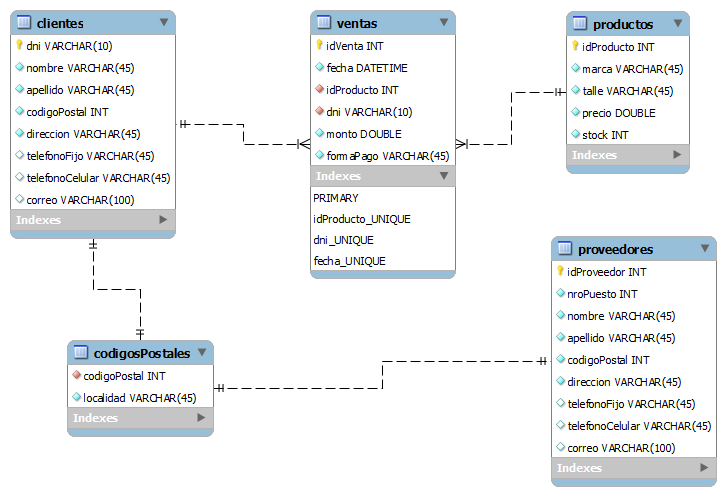
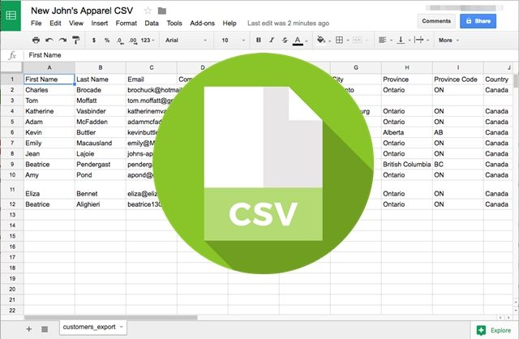

[`Introducción a Bases de Datos`](../Readme.md) > `Sesión 07`

## Sesión 8: Configuración de Bases de Datos Locales


<div style="text-align: justify;">

### 1. Objetivos :dart: 

- Generar clusters de Mongo
- Definir bases de datos en Mongo Atlas
- Modificar colecciones y documentos de bases de datos no relacioales

### 2. Contenido :blue_book:

<!-- #### Parte I: Configuración de Bases Relacionales

---
##### <ins>Operaciones con bases de datos</ins>


Un servidor de bases de datos se compone de distintas bases con propósitos distintos. Por ejemplo, podemos tener en un mismo servidor una base de datos de empleados y otra de prodcutos, si se trata de una tienda.

Para crear bases de datos, se usa el comando:

```sql
CREATE DATABASE <nombre>;
```

> *Explicar la diferencia entre servidor de base de datos y base de datos (esquema), así como ejemplos de creación de bases de datos.*

- [**`EJEMPLO 1`**](Ejemplo-01/Readme.md)

---
##### <ins>Realizando operaciones con tablas</ins>


Como hemos visto, una tabla se compone de renglones, columnas, tipos asociados a las columnas, llaves primarias y foráneas y por supuesto los valores que almacena.

Para crear una tabla se usa el comando (en su forma simple):

```sql
   CREATE TABLE (
      nombre tipo,
      ...
   );
```

> *Mostrar ejemplos de creación de tablas con llaves y los distintos tipos de datos de __MySQL__.*

- [**`EJEMPLO 2`**](Ejemplo-02/Readme.md)
- [**`RETO 1`**](Reto-01/Readme.md)

---
##### <ins>Importando datos a una tabla en formato CSV</ins>


Para cargar datos en una tabla o base de datos completa es usar que se deban utilizar archivos como lo son *CSV* o *JSON*. *CSV* es uno de los más utilizados y admitidos por __MySQL Workbench__.

Un archivo *CSV* se conforma de un encabezado que indica el nombre de las columnas separado por comas y cada uno de los registros, separando el valor para cada campo por comas. 

> *Mostrar algún archivo CSV y explicar cada una de sus partes.*

- [**`EJEMPLO 3`**](Ejemplo-03/Readme.md)
- [**`RETO 2`**](Reto-02/Readme.md)

--- -->

#### Parte II: Configuración de Bases No Relacionales

---
##### <ins>Configuración de __MongoDB__ en la nube</ins>


Para facilitar la creación de servidores de bases de datos (llamados *clusters* pues se conforman de varios servidores a la vez), __MongoDB__ provee una platadorma que permite crear bases de datos en la nube de forma sencilla. 

Esta plataforma, llamada __Atlas__ permite crear un *cluster* de forma gratuita por lo que lo usaremos para ejemplificar este proceso. Puede utilizarlo también para tu proyecto.

<!-- > *Explicar el concepto de base de datos en la nube y su principal diferencia con una base de datos local. Mostrar similudes con el servicio AWS de Amazon.* -->

- [**`EJEMPLO 1`**](Ejemplo-04/Readme.md)

---
##### <ins>Operaciones con bases de datos</ins>


Una vez configurado el *cluster* a partir de __MongoDB Atlas__, podemos conectar a la misma a través de __MongoDB Compass__ y por lo tanto podremos crear bases de datos desde aquí.

Lo único que solicita __MongoDB Compass__, a través de una interfaz gráfica, es el nombre de la base de datos.

Por cierto, __MongoDB Compass__ no es el único cliente de __MongoDB__, también existen otras herramientas como __Robo 3T__ o el *shell* de __MongoDB__.

<!-- > *Mostrar la pantalla de creación de bases de datos de Compass*. -->

- [**`EJEMPLO 2`**](Ejemplo-05/Readme.md)

---
##### <ins>Realizando operaciones con Colecciones e importando datos</ins>


Al igual que en __MySQL__ es posible cargar los datos usando formatos de intercambio de información como son __CSV__ o __JSON__. En el caso de __JSON__ se debe separar cada documento por comas.

- [**`EJEMPLO 3`**](Ejemplo-06/Readme.md)
- [**`RETO 1`**](Reto-03/Readme.md)

---
##### <ins>Realizando operaciones con Documentos</ins>


Una vez creada una colección, ya sea mediante la carga masiva de datos o de forma vacía. Es posible modificar los documento que se almacenan ahí. Es posible:

1. Agregar documentos
1. Editar documentos
1. Eliminar documentos

- [**`EJEMPLO 4`**](Ejemplo-07/Readme.md)

---

#### Parte II: API's

##### <ins>Usar API's para obtener información</ins>


Una API es un conjunto de funciones y procedimientos que cumplen una o muchas funciones con el fin de ser utilizadas por otro software o usuarios. Las siglas API vienen del inglés Application Programming Interface. En español sería Interfaz de Programación de Aplicaciones. 

Existen muchos tipos de API's, las que nos interesan son las de consulta de datos, estás son usadas como un mecanismo de obtener información para diferentes propósitos como podría ser el análisis de datos. Existen muchas API's disponibles en internet, muchas de estas son gratuitas y públicas sin embargo hay otras que requieren de una cuenta de usuario especial o tienen algún costo. Aquí mostraremos algunas muy útiles. 

+ Datos abiertos del Gobierno de la Ciudad de México: en esta API se puede consultar toda la información de la CDMX en cuestión de presupuestos, transporte, turismo, educación, salud, seguridad, entre muchos otros. Los datos son actualizados periódicamente para consultarla basta con entrar al [sitio](https://datos.cdmx.gob.mx/explore) y buscar la información deseada 

+ API datos.gob.mx: aquí se puede consultar la información relacionada con los datos del gobierno de México, es muy parecida a la anterior solo que a nivel federal. El sitio de consulta está [aquí](https://datos.gob.mx/blog/catalogo-apidatosgobmx)

+ Spotify for Developers: en está API se puede obtener toda la información publica de la aplicación de música Spotify, tales como canciones, artistas, playlists así como sus estadísticas y reproducciones. Para consultarla se usa el siguiente [enlace](https://developer.spotify.com/documentation/web-api/)

+ Facebook: para acceder a la información de la API se necesita una cuenta de desarrollador, en el [enlace](https://developers.facebook.com/docs/apis-and-sdks?locale=es_ES) se describe el proceso.

+ Twitter Developer: está API es de las mas utilizadas para el análisis de datos y el ordeñamiento de tweets. Se puede consultar el [link](https://developer.twitter.com/en)

+ Google Maps Platform: Toda la información de Google maps disponible en el [enlace](https://cloud.google.com/maps-platform?hl=es). 

Google es de los principales proveedores de API's casi todos sus productos tienen una para la consulta de sus datos, la mayoría no son gratuitas. 

Como alternativa a API's se pueden utilizar datasets de prueba, esto es cuando se esta haciendo un proyecto en el que la actualización o veracidad de los datos no es relevante. Estos datasets usualmente tienen la información suficiente para realizar proyectos o pruebas en datos. Una página para descarga de estos datasets es [Kaggle](https://www.kaggle.com) que cuenta con una gran variedad de datos. 

<!-- ##### <ins>JSON</ins>
JSON (JavaScript Object Notation) es un estándar para intercambio de información que es fácilmente interpretable tanto para una persona como para una computadora. 

En la actualidad este formato es utilizado por muchos lenguajes de programación como lo son JavaScript, Java, Python, C, C++, entre otros.

La extensión de un archivo JSON es .json


- [**`EJEMPLO 5`**](Ejemplo-05/Readme.md)
- [**`RETO 3`**](Reto-03/Readme.md) -->
### 3. Proyecto :hammer:

Aplica lo todo lo que aprendiste durante la sesión en este proyecto. 

- [**`PROYECTO SESIÓN 7`**](Proyecto/Readme.md)

### 4. Postwork :memo:
Aplica lo todo lo que aprendiste durante la sesión a tu proyecto personal.

- [**`POSTWORK SESIÓN 7`**](Postwork/Readme.md)

</br>

[`Anterior`](../Sesion-06/Readme.md) | [`Siguiente`](../Sesion-08/Readme.md)

</div>   
