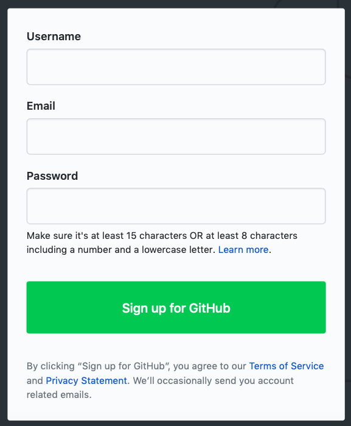
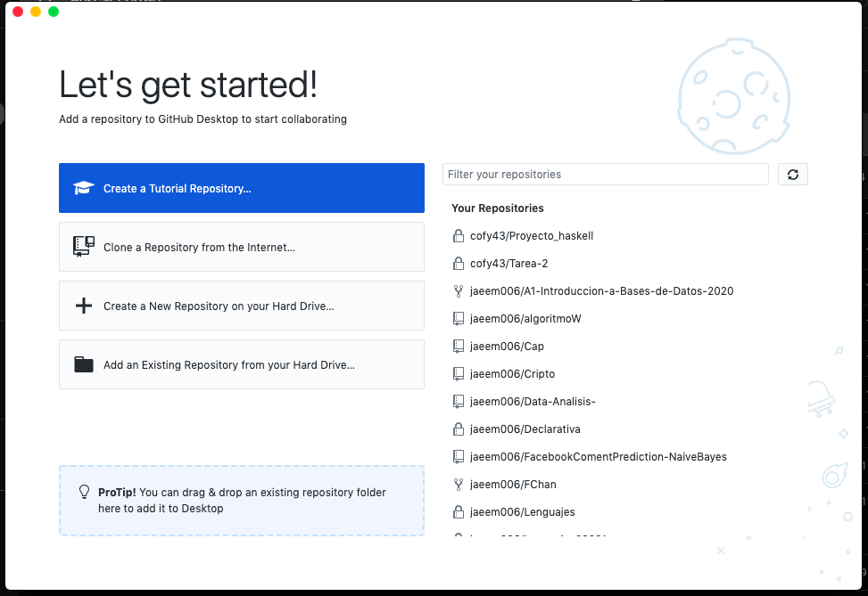
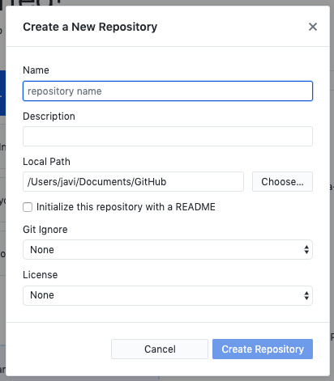
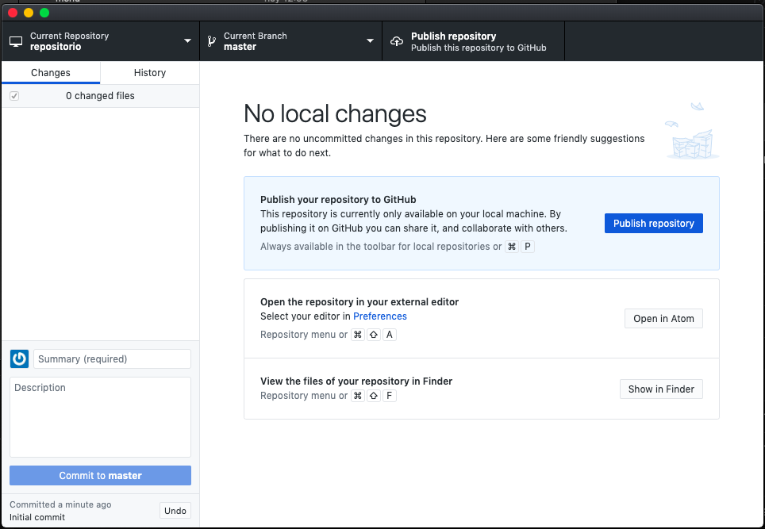
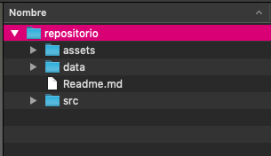
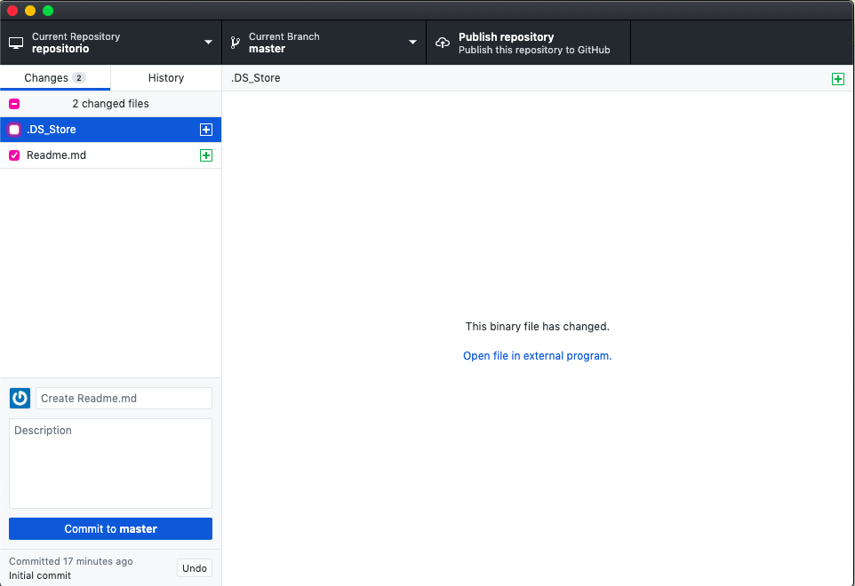
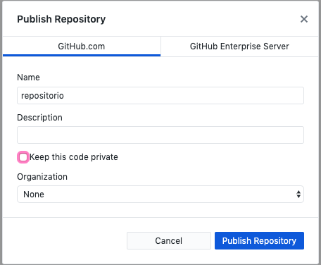

[`Introducción a Bases de Datos`](../../Readme.md) 

## Ejemplo 1: Comenzando en GitHub

### 1. Objetivos :dart:
- Crear una cuenta en la plataforma GitHub
- Crear tu primer repositorio
- Exportar Repositorios

### 2. Requisitos :clipboard:
- GitHub Desktop instalado

### 3. Desarrollo :rocket:

1.  Abrir un explorador y entrar a la página de [GitHub](https://www.github.com)

2. Al entrar aparecerá la página principal en la cual se muestra un formulario para crear una cuenta. Llena esta información, o en caso de a contar con una cuenta simplemente iniciar sesión

3. Una vez dentro de tu perfil aparece un menú con diferentes pestañas.

En la pestaña de repositorios se puede ver todos los proyectos de nuestro perfil. Es importante señalar que todos estos repositorios son públicos para que cualquier persona pueda consultarlos, esta es una de las principales ventajas de Git, el acceso a el código de otras personas que puede servir como ejemplos o tutoriales o incluso es ampliamente utilizado en procesos de reclutamiento de empresas de software. Esta característica tiene el nombre de open source. 

Como se trata de repositorios públicos no se deben publicar información sensible como pueden ser contraseñas o credenciales de acceso a servidores o bases de datos.

4. Para crear nuevos repositorios vamos a usar el programa GitHub Desktop, lo abrimos y lo asociamos con nuestra cuenta que acabamos de crear.

5. Una vez que iniciamos sesión se mostrará la siguiente pantalla.

Con la opción de crear un nuevo repositorio, seleccionamos esa opción y aparece el siguiente formulario con la información necesaria para crear un repositrio

llenamos la información y creamos el repositorio.

Este repositorio fue creado de forma local, es decir solo existe en nuestro ordenador, para que se almacene en el servidor de GitHub tenemos que publicarlo. Antes de hacerlo vamos a estructurar el proyecto. Para esto vamos a presionar el botón para ver el repositorio en nuestro sistema de archivos.

6. Ya en el sistema de archivos vamos a crear la siguiente estructura de carpetas muy útil en un proyecto de análisis de datos

En la carpeta __data__ se van a guardar los datasets del proyecto, es decir los archivos con la información. 

En la carpeta __src__ se va a guardar todo el código que se escriba para el proyecto.

En la carpeta __assets__ se guardan paqueterias o material adicional para el funcionamiento del proyecto. 

Y en el archivo __Readme.md__ se da una descripción del proyecto para que el público de GitHub pueda leerla antes de consultar el código. Este archivo se escribe en el lenguaje MarkDown, para conocerlo consulta el siguiente [link](https://github.com/adam-p/markdown-here/wiki/Markdown-Cheatsheet)

7. Ya que se tiene la estructura del proyecto, volvemos a GitHub Desktop. Ahora se vera la siguiente vista

En donde se muestran los cambios que se hicieron al repositorio. En la parte superior se muestran los archivos creados, mientras que en la parte inferior aparecen dos inputs para generar un commit. 

Un commit es una versión de nuestro proyecto, cada commit va a marcar un punto en el tiempo al cual podemos volver. 

El primer input pide un nombre al commit simplemente ponemos _Create Readme.md_ el siguiente pide una descripción, lo dejamos en blanco y presionamos el botón __commit to master__ 

8. Para finalizar presionamos el la parte superior el botón que dice __Publish repository__ y aparece la siguiente ventana, en la cual simplemente presionamos el botón azul.

De esta forma el repositorio se publica en nuestro perfil de GitHub. 

En la pestaña __History__ de GitHub Desktop se puede consultar el historial completo de commits.

Mientras que en el sitio de GitHub ya debe ser visible nuestro repositorio.
 
  
