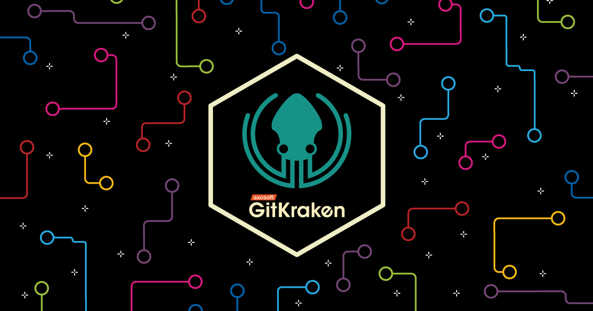
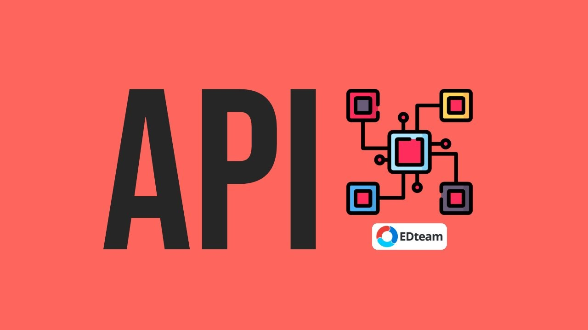

[`Introducción a Bases de Datos`](../Readme.md) > `Sesión 09`

## Sesión 9: Sistemas de control de versiones y API's

### 1. Objetivos :dart: 

- Definir un sistema de control de versiones
- Conocer herramientas para usar GitHub
- Consultar las principales API's 

### 2. Contenido :blue_book:

#### Parte I: Control de versiones

---
##### <ins>Sistemas de control de versiones</ins>

En muchas ocasiones cuando se está desarrollando un proyecto nuestro sistema de carpetas suele verse de la siguiente forma

Es decir, se tienen muchas copias del mismo proyecto, cada una con la promesa de ser la definitiva. Esto es muy poco eficiente pues no tenemos un control real de los cambios que hay entre cada versión ni podemos revertir cambios específicos entre estas versiones.

Ese es justo el propósito de los sistemas de control de versiones. El sistema de control de versiones registra los cambios realizados sobre un conjunto de archivos a lo largo del desarrollo del proyecto, con dos características elementales: 

+ Definir con claridad los cambios que hay entre cada una de las versiones
+ La posibilidad de revertir los cambios hechos en una nueva versión

Estos sistemas son especialmente útiles en la programación, en donde poder revertir cambios hechos al código es de mucha ayuda. 

Existen diferentes sistemas de gestor de versiones, quizá los mas conocidos sean: Google Drive o Dropbox. Sin embargo hay gestores de versiones con uso especifico para código como son:  CVS, Git, Subversion, Mercurial y Baazar. El que usaremos en esta sesión es Git.

---
##### <ins>Git</ins>

Git es un sistema de control de versiones diseñado por Linus Torvalds, pensando en lel mantenimiento de versiones de aplicaciones de gran tamaño. Su propósito es llevar registro de los cambios en archivos de computadora y coordinar el trabajo que varias personas realizan sobre archivos compartidos.

Para usar Git existen diferentes plataformas siendo la mas popular GitHub de Microsoft, pero hay otras opciones como son: GitLab, BitBucket, entre muchas otras. 

- [**`EJEMPLO 1`**](Ejemplo-01/Readme.md)
- [**`RETO 1`**](Reto-01/Readme.md)
 
 ---
##### <ins>GitKraken</ins>

Una forma mas gráfica de visualizar el historial de cambios de un repositorio es con herramientas de gestión como lo es GitKraken, esta herramienta proporciona un ambiente gráfico para la manipulación de repositorios.

 
 

---
#### Parte II: API's

##### <ins>Usar API's para obtener información</ins>

Una API es un conjunto de funciones y procedimientos que cumplen una o muchas funciones con el fin de ser utilizadas por otro software o usuarios. Las siglas API vienen del inglés Application Programming Interface. En español sería Interfaz de Programación de Aplicaciones. 

Existen muchos tipos de API's, las que nos interesan son las de consulta de datos, estás son usadas como un mecanismo de obtener información para diferentes propósitos como podría ser el análisis de datos. Existen muchas API's disponibles en internet, muchas de estas son gratuitas y públicas sin embargo hay otras que requieren de una cuenta de usuario especial o tienen algún costo. Aquí mostraremos algunas muy útiles. 

+ Datos abiertos del Gobierno de la Ciudad de México: en esta API se puede consultar toda la información de la CDMX en cuestión de presupuestos, transporte, turismo, educación, salud, seguridad, entre muchos otros. Los datos son actualizados periódicamente para consultarla basta con entrar al [sitio](https://datos.cdmx.gob.mx/explore) y buscar la información deseada 

+ API datos.gob.mx: aquí se puede consultar la información relacionada con los datos del gobierno de México, es muy parecida a la anterior solo que a nivel federal. El sitio de consulta está [aquí](https://datos.gob.mx/blog/catalogo-apidatosgobmx)

+ Spotify for Developers: en está API se puede obtener toda la información publica de la aplicación de música Spotify, tales como canciones, artistas, playlists así como sus estadísticas y reproducciones. Para consultarla se usa el siguiente [enlace](https://developer.spotify.com/documentation/web-api/)

+ Facebook: para acceder a la información de la API se necesita una cuenta de desarrollador, en el [enlace](https://developers.facebook.com/docs/apis-and-sdks?locale=es_ES) se describe el proceso.

+ Twitter Developer: está API es de las mas utilizadas para el análisis de datos y el ordeñamiento de tweets. Se puede consultar el [link](https://developer.twitter.com/en)

+ Google Maps Platform: Toda la información de Google maps disponible en el [enlace](https://cloud.google.com/maps-platform?hl=es). 

Google es de los principales proveedores de API's casi todos sus productos tienen una para la consulta de sus datos, la mayoría no son gratuitas. 

Como alternativa a API's se pueden utilizar datasets de prueba, esto es cuando se esta haciendo un proyecto en el que la actualización o veracidad de los datos no es relevante. Estos datasets usualmente tienen la información suficiente para realizar proyectos o pruebas en datos. Una página para descarga de estos datasets es [Kaggle](https://www.kaggle.com) que cuenta con una gran variedad de datos. 

[`Anterior`](../Sesion-08/Readme.md) 

   
