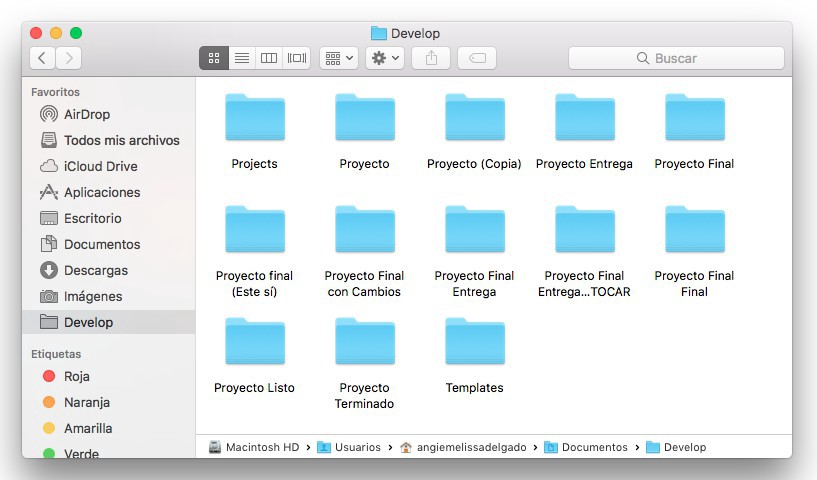

[`Introducción a Bases de Datos`](../Readme.md) > `Sesión 09`

## Sesión 9: Sistemas de control de versiones y API's

### 1. Objetivos :dart: 

- Definir un sistema de control de versiones
- Conocer herramientas para usar GitHub
- Consultar las principales API's 

### 2. Contenido :blue_book:

#### Parte I: Control de versiones

---
##### <ins>Sistemas de control de versiones</ins>

Cuando se está desarrollando (escribiendo código) o manejando sistemas 

- [**`EJEMPLO 1`**](Ejemplo-01/Readme.md)

---
##### <ins>JSON</ins>
JSON (JavaScript Object Notation) es un estándar para intercambio de información que es fácilmente interpretable tanto para una persona como para una computadora. 

En la actualidad este formato es utilizado por muchos lenguajes de programación como lo son JavaScript, Java, Python, C, C++, entre otros.

La extensión de un archivo JSON es .json

- [**`EJEMPLO 2`**](Ejemplo-02/Readme.md)
- [**`RETO 1`**](Reto-01/Readme.md)

#### Parte II: API's

[`Anterior`](../Sesion-07/Readme.md) | [`Siguiente`](../Sesion-08/Readme.md)

   
