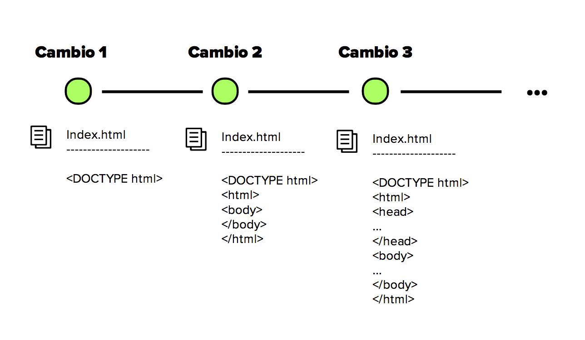
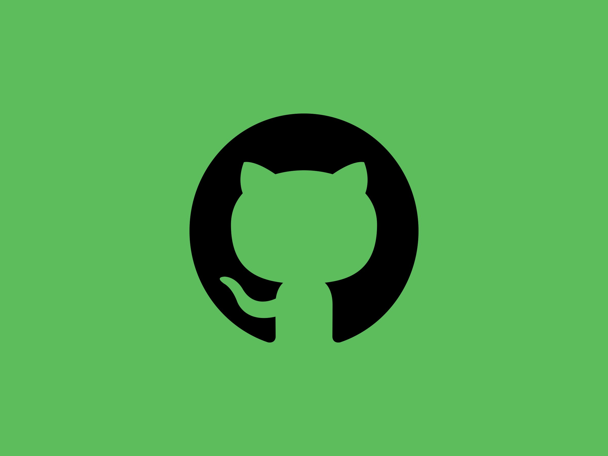

[`Introducción a Bases de Datos`](../Readme.md) > `Sesión 09`

## Sesión 9: Sistemas de control de versiones y API's

### 1. Objetivos :dart: 

- Definir un sistema de control de versiones
- Conocer herramientas para usar GitHub
- Consultar las principales API's 

### 2. Contenido :blue_book:

#### Parte I: Control de versiones

---
##### <ins>Sistemas de control de versiones</ins>

En muchas ocasiones cuando se está desarrollando un proyecto nuestro sistema de carpetas suele verse de la siguiente forma

Es decir, se tienen muchas copias del mismo proyecto, cada una con la promesa de ser la definitiva. Esto es muy poco eficiente pues no tenemos un control real de los cambios que hay entre cada versión ni podemos revertir cambios específicos entre estas versiones.

Ese es justo el propósito de los sistemas de control de versiones. El sistema de control de versiones registra los cambios realizados sobre un conjunto de archivos a lo largo del desarrollo del proyecto, con dos características elementales: 

+ Definir con claridad los cambios que hay entre cada una de las versiones
+ La posibilidad de revertir los cambios hechos en una nueva versión

Estos sistemas son especialmente útiles en la programación, en donde poder revertir cambios hechos al código es de mucha ayuda. 

Existen diferentes sistemas de gestor de versiones, quizá los mas conocidos sean: Google Drive o Dropbox. Sin embargo hay gestores de versiones con uso especifico para código como son:  CVS, Git, Subversion, Mercurial y Baazar. El que usaremos en esta sesión es Git.

---
##### <ins>Git</ins>

Git es un sistema de control de versiones diseñado por Linus Torvalds, pensando en lel mantenimiento de versiones de aplicaciones de gran tamaño. Su propósito es llevar registro de los cambios en archivos de computadora y coordinar el trabajo que varias personas realizan sobre archivos compartidos.

Para usar Git existen diferentes plataformas siendo la mas popular GitHub de Microsoft, pero hay otras opciones como son: GitLab, BitBucket, entre muchas otras. 

- [**`EJEMPLO 1`**](Ejemplo-01/Readme.md)
- [**`RETO 1`**](Reto-01/Readme.md)

##### <ins>GitKraken</ins>

#### Parte II: API's

[`Anterior`](../Sesion-08/Readme.md) 

   
